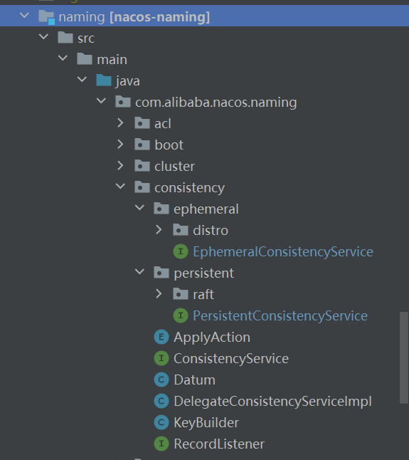

# Nacos 的一致性存储解析--Distro 篇


作为一个服务发现和配置管理基础设施, 一致性协议可以在集群内保证各类元数据的一致性. Nacos 提供了两个等级的一致性, CP 用于配置管理, AP 用于服务发现. 该系列分析基于源码 1.1.3 版本. 从 1.1.4 开始用 JRaft 替换了原生的 private-raft, 但我只对后者感兴趣所以延续使用 1.1.3 版本代码进行分析. 

**文章里涉及代码不多, 主要解释原理, 如果看注释可以[点这里](https://github.com/chienlungcheung/nacos-with-annotation).**

## 1 开始之前

在详细描述协议之前, 我们可以试想下, 如果我们自己设计一套一致性存储, 应该怎么来设计? 

1. 首先就是存储, 要支持以下几个操作

- 增-put
- 删-remove
- 改(覆盖)-put
- 查-get

2. 其次是一致性

要在涉及变更时通知其它存储节点, 这个特性是修饰. 而通知根据一致性等级分为两种:
- 同步通知, 强一致性, 变更操作和通知逻辑耦合在一起;
- 异步通知, 最终一致性, 变更时发起后台通知, 确保最终一致.

类似地, 如何接收其它存储节点的通知也分为两种:
- 被动式, 开一个接口等着其它节点推送变更通知过来;
- 主动式, 定期轮询其它节点的接口查询变更.

3. 最后一个问题, 一致性集群本身节点上下线如何处理
- 主动式: 基于配置, 每个节点定期扫配置, 发现有节点上下线则更新本地维护列表.
- 被动式: 啥也不管, 开放一个专门接口, 如果有节点上线自动 ping 一下收到就更新列表; 针对维护的列表, 自己定时 ping 一下对端同样接口, 根据是否响应判断存活.

以上几个问题贯穿接下来的系列文章.

好, 我们来看看 Nacos 是怎么做的.

## 2 代码布局

我们先看看确保一致性的代码位于何处. 如下图所示



Nacos 一致性协议代码整体位于 `com.alibaba.nacos.naming.consistency` 这个包下面. 其中 `ephemeral` 包下的 `distro` 协议是 AP 级别的一致性, 用于服务发现; `persistent` 包下的 `raft` 协议是 CP 级别的一致性, 用于配置管理.

## 3 一致性协议接口设计

```java
/**
 * 与实现无关的一致性服务接口，将一致性协议实现与业务逻辑解耦，
 * 用户也可以自己定义一套一致性协议实现, 只要提供这里要求的接口即可.
 */
public interface ConsistencyService {

    /**
     * 将一对 <key, value> 写入 Nacos 集群
     */
    void put(String key, Record value) throws NacosException;

    /**
     * 根据 key 从 Nacos 集群移除相关数据
     */
    void remove(String key) throws NacosException;

    /**
     * 根据 {@code key} 从 Nacos 集群查询相关数据
     */
    Datum get(String key) throws NacosException;

    /**
     * 为与 key 对应的数据新增一个监听器，以监听 Nacos 集群中相关数据的变化
     */
    void listen(String key, RecordListener listener) throws NacosException;

    /**
     * 从与 key 对应的数据的监听器列表中移除指定的监听器
     */
    void unlisten(String key, RecordListener listener) throws NacosException;

    /**
     * 检查该一致性服务是否可用
     */
    boolean isAvailable();
}

```

### 3.1 AP 级一致性协议 distro

该级别协议用于服务发现, 服务发现典型的要求被发现的服务节点要和 nacos 保持连接, 所以都是 ephemeral 的.

```java
/**
 * 专用于临时(ephemeral)数据的一致性协议.
 *
 * 这个协议服务的数据不要求存在磁盘或数据库里, 因为临时数据会与 server
 * 保持一个 session, 只要 session 还活着, 临时数据就不会丢.
 *
 * 该协议要求写操作要总是成功, 即使发生了网络分区, 也就是说这个协议
 * 是 AP 级别的一致性. 当网络恢复的时候, 数据和每个分区被合并为一个集合,
 * 所以整个集群达成最终一致.
 */
public interface EphemeralConsistencyService extends ConsistencyService {
}
```
### 3.2 CP 级一致性协议

该级别协议用于配置管理, 配置需要落盘和重复使用, 而且各个 reader 看到的要一样否则可能导致业务出现重大问题, 所以要确保严格一致. 

```java
/**
 * 实现该接口的都能保证 CP 级别一致性, 这意味着:
 * 一旦写操作的响应为成功, 相关数据就被保证成功写入了集群, 而且,
 * 协议保证数据在各个 server 之间是一致的.
 */
public interface PersistentConsistencyService extends ConsistencyService {
}
```

CP 级协议分析本篇不着墨.

上面代码中只涉及了通用接口, 确切地说只是跟存储有关的接口, 与一致性相关的通通没有涉及. 这与文章开头我们分析“一致性存储”设计的时候提到的两个属性的优先级一致.

## 4 Distro 协议详解

Distro 协议用于服务发现, 接下来我会从这几个维度进行解析:
- 存储设计
- 一致性设计
- Distro 集群节点上下线设计
- 服务发现交互设计

那 Distro 到底是啥意思?

Distro 协议用于服务发现, 当大量服务存在的时候, 相应的也会有大量的服务实例, 此时就要在 nacos 集群做分工, 每个 nacos 节点负责一组服务, 主要工作一为健康检查, 二为定期同步自己维护部分的数据校验和给其它 nacos 节点同时响应其它 nacos 节点拉取自己负责部分数据的工作.

Distro 协议(其实叫 Partition 协议)会将服务分组, 每个 Nacos 节点负责一组服务对应的实例健康检查.

上述分组的逻辑为:

```java
public boolean responsible(String serviceName) {
    // 获取当前 nacos 节点索引
    int index = healthyList.indexOf(NetUtils.localServer());
    int lastIndex = healthyList.lastIndexOf(NetUtils.localServer());
    if (lastIndex < 0 || index < 0) {
        return true;
    }

    // 计算 serviceName 的哈希值以及谁应该负责维护它
    int target = distroHash(serviceName) % healthyList.size();
    // 如果 target 与 index 一样, 则当前 nacos 节点负责维护该 service.
    return target >= index && target <= lastIndex;
}
```

Nacos 的健康检查和心跳检测是一套很完整也略微复杂的子系统, 回头细讲.

### 4.1 Distro 存储设计

存储相关的增删改查与我们设想一致.

1. 增

```java
/**
  * 写入数据, 以 Distro 协议进行一致性保证. 
  * 用户要确保 key 全局唯一, 否则会被覆盖.
  */
@Override
public void put(String key, Record value) {
    onPut(key, value);
    // 数据有更新, 启动一个数据同步任务, 当前 nacos 节点会
    // 将本次变更主动同步给其它 nacos 节点.
    taskDispatcher.addTask(key);
}

```

2. 删

```java
/**
  * 移除数据, Distro 负责善后.
  */
@Override
public void remove(String key) {
    onRemove(key);
    listeners.remove(key);
}
```
3. 改

同增.

4. 查
```java
/**
  * 查询数据, 因为底层存储就是并发 map, 线程安全也能确保一致性.
  */
@Override
public Datum get(String key) {
    return dataStore.get(key);
}
```

作为几个操作核心底层的 `dataStore` 就是一个并发 map, 是的, 如前所述, Distro 协议数据保存在内存中, 不做持久化.

下面来看看一致性通知是怎么实现的.

### 4.2 Distro 一致性设计

这部分要思考三个问题:
- 一个 Nacos 节点数据发生变更时如何通知其它节点实现一致性?
- 一个 Nacos 节点如何感知其它节点的变更?
- Nacos 节点数据变更后如何告知客户端?

前两个问题其实是一个问题, 也就是通知的**发**与**收**.

#### 4.2.1 Distro 节点之间直接交互变更数据实现一致性

我们直接看看变更方法 `put` 里发生的事情:

```java
@Override
public void put(String key, Record value) {
    onPut(key, value);
    // 数据有更新, 启动一个数据同步任务, 当前 nacos 节点会
    // 将本次变更主动同步给其它 nacos 节点.
    taskDispatcher.addTask(key);
}
```

这段代码逻辑很简单, 直接回答了上面提到的第一个问题: **主动发通知, 而且是异步网络通知**. (具体发送见 `TaskDispatcher::addTask()`.)

回答了第一个问题, 第二个就呼之欲出了. 在节点主动发通知时, 目的 endpoint 为 `/distro/datum`, 我们在代码中搜索响应这个 endpoint 的代码, 其位于 `com.alibaba.nacos.naming.controllers.DistroController::onSyncDatum()`.

所以第二个问题的答案就是: **Nacos 通过 `DistroController` 对外发布的 `/distro/datum` 接收其它节点发来的变更通知**. 接收到数据后会调用下述代码更新本地数据以实现与发送端数据的一致性:

```java
public void onPut(String key, Record value) {

  if (KeyBuilder.matchEphemeralInstanceListKey(key)) {
      Datum<Instances> datum = new Datum<>();
      datum.value = (Instances) value;
      datum.key = key;
      // 推动时钟前进
      datum.timestamp.incrementAndGet();
      // 放入当前 nacos 节点存储
      dataStore.put(key, datum);
  }

  // 如果没有监听器对该 key 感兴趣则不做通知
  if (!listeners.containsKey(key)) {
      return;
  }

  // 发通知, key 对应数据有变更
  notifier.addTask(key, ApplyAction.CHANGE);
}
```

`onPut` 方法将变更写入本地存储, 注意, 由于数据就是其它 nacos 节点发过来的所以不用再发通知了.

总结: Distro 协议在响应用户写数据请求时调用 `put` 方法将数据写存储同时主动发送异步通知给其它节点; Distro 协议监听 `/distro/datum` 接口请求接收其它 nacos 节点的变更通知, 并将变更写入本地存储. 从而实现了数据的一致性.

#### 4.2.2 Distro 节点之间通过校验和实现数据一致

Distro 协议的 `DataSyncer` 会定期同步本地 nacos 节点负责的数据校验和给其它 nacos 节点, 如果对端检测到不一致会来拉取数据; 如果外部调用 Distro 的 `put` 等操作导致本地数据变更时, 本地 nacos 节点会在 `TaskDispatcher` 追加一个同步任务将变更数据同步到其它 nacos 节点(注意此时不分数据是否本地 nacos 节点负责).

1. 发送校验和请求

`DataSyncer` 会在后台周期性调度 `TimedSync` 任务, 该任务负责计算当前 nacos 节点负责的数据对应的校验和并发送给其它 nacos 节点:

```java
public class TimedSync implements Runnable {

    @Override
    public void run() {
        Map<String, String> keyChecksums = new HashMap<>(64);
        // 为当前 nacos 节点负责的数据计算校验和
        for (String key : dataStore.keys()) {
            if (!distroMapper.responsible(KeyBuilder.getServiceName(key))) {
                continue;
            }

            keyChecksums.put(key, dataStore.get(key).value.getChecksum());
        }

        // 将上面计算出来的校验和同步给其它 nacos 节点的 /distro/checksum,
        // 其它节点发现校验和冲突的时候会主动来拉取数据.
        for (Server member : getServers()) {
            if (NetUtils.localServer().equals(member.getKey())) {
                continue;
            }
            NamingProxy.syncCheckSums(keyChecksums, member.getKey());
        }
    }
}
```

2. 接收校验和请求

接收请求的接口为 `/distro/checksum`, 校验和请求处理流程(具体代码见 `DistroConsistencyServiceImpl::onReceiveChecksums`):
- 通过接口接收校验和请求, 请求包含数据的 key 以及数据的校验和(无具体数据的 value).
- 与本地数据比对, 如果本地不存在对应 key 或者校验和与请求中不同, 则再去请求校验和来源的数据 value 更新本地数据.
- 与本地数据比对, 如果本地包含不在请求中的 key, 则删除相关数据.

3. 数据不一致, 从校验和发送方拉取数据

校验和接收端发现数据不一致的时候, 该删除的删除, 针对该更新的, 就要去校验和发送方去拉取. 其中, 拉取数据的接口为 `/distro/datum`, 不过此处用的是 GET 请求.

#### 4.2.3 Nacos 如何将服务变更告知客户端

上面讲了数据变更时 nacos 集群节点间如何互相告知, 那客户端是怎么知道的呢?

我们以前面讲到 `put` 操作时提到的 `onPut` 为例:
```java
public void onPut(String key, Record value) {

  if (KeyBuilder.matchEphemeralInstanceListKey(key)) {
      Datum<Instances> datum = new Datum<>();
      datum.value = (Instances) value;
      datum.key = key;
      // 推动时钟前进
      datum.timestamp.incrementAndGet();
      // 放入当前 nacos 节点存储
      dataStore.put(key, datum);
  }

  // 如果没有监听器对该 key 感兴趣则不做通知
  if (!listeners.containsKey(key)) {
      return;
  }

  // 发通知, key 对应数据有变更
  notifier.addTask(key, ApplyAction.CHANGE);
}
``` 

只关注最后一行代码, `DistroConsistencyServiceImpl` 在初始化时会在后台启动一个 `Notifier` 任务, 它负责在 nacos 数据变更时触发相关操作告知对相关数据感兴趣的客户端. 最终通过 `Service::onChange` 方法触发 `PushService` 的通知方法. 至于 `PushService` 是如何感知到客户端的, 这在后面服务发现相关章节进行分析. 


### 4.3 Distro 集群节点上下线设计

Nacos 集群节点上下线处理(包括硬的和软的), 含 distro 和 raft 两套集群.

其中主角是 `ServerListManager`, 它负责两件事情: 
- 一是定期检测集群配置文件或环境变量感知 nacos 集群节点变更, 如果有变化则加载并调用监听器进行通知; 
- 二是维护 distro 集群各节点之间的心跳, 注意这个心跳是 nacos 节点之间的不是客户端和 nacos 之间的, 如有节点出问题或者重新上线都能检测到.

`ServerListManager` 有两个定时任务(第二个任务只为 Distro 协议服务, Raft 不需要.): 
- 一个用于定时检测配置文件或环境变量感知集群节点"硬"变化; 
- 一个用于定期发送状态报告给整个集群的 nacos 节点用于检测全量节点到底多少是活跃的, 如果有节点虽然还在配置名单上但突然挂了或者突然活了都会被检测到, 感知集群"软"变化. 

Raft 协议各节点之间有定期心跳, 天然能感知配置文件里的全量节点有多少是活跃的; Distro 由于协议本身并没有设计和实现节点间心跳, 所以它对全量节点不感冒, 只对健康节点感兴趣, 是否健康靠的是 `ServerListManager` 定期触发状态报告这类心跳来检测的. 两个小配角 `DistroMapper` 和 `RaftPeerSet` 都实现了 `ServerChangeListener` 监听器接口, 注册到 `ServerListManager`, 一旦集群节点变更就会受到通知. 

### 4.4 Distro 用于服务发现, 客户端是如何与 nacos 进行交互的

在服务发现中, 客户端可以扮演两类角色:
- 一是作为服务实例向 nacos 注册或者解除注册自己.
- 二是作为服务发现客户端订阅自己感兴趣的服务.

在 nacos client 包里有一个 `NacosService` 类, 该类会被用户集成到自己代码中作为客户端使用.

客户端 `NacosService` 启动时会初始化一个 `BeatReactor`, 如果该客户端会作为服务实例向 nacos 注册或解除注册服务发现, 则会启动心跳任务定期向 nacos 的 `/instance/beat` 接口发送心跳请求. Nacos 在 `InstanceController` 接收并处理该请求, 刷新该客户端对应的最后一次心跳时间戳, nacos 有后台任务检测该时间戳判断客户端是否挂了.

客户端 `NacosService` 在注册或者解除注册时, 会触发 nacos 数据变化, 该变化会导致接收这两类请求的 nacos 节点向其它 nacos 节点同步变更后的数据(也就是前面讲过的 `put` 触发的同步流程), 同时通过 `PushService` 通知订阅相关服务的订阅者.

客户端 `NacosService` 如果作为服务发现客户端而不是某个服务的实例存在, 那么其在调用 `queryList` 方法向 nacos 的 `/instance/list` 接口获取对应服务的实例列表时, 会通过 `HostReactor` 启动 `UpdateTask`, 该任务定期请求前述 API 接口刷新本地的实例列表. `queryList` 同时会将客户端的 ip 和端口(即 `PushReceiver`)发送给 nacos, 后者在该客户端订阅服务实例列表发生变更时会通过 `PushService` 主动推送 udp 数据包过来. 

上面说 `UpdateTask` 时提到了"定期"一词, 客户端为何需要定期获取列表呢? 因为 `PushService` 维护着庞大的客户端列表, 它怎么知道哪个客户端活着呢? 靠的就是这个客户端这个"定期"获取列表的副租用实现的.

以上即是客户端分别作为服务实例或服务发现客户端时与 nacos 交互的核心流程.

## 5 总结

Distro 协议作为 nacos 自行实现的一套 AP 级一致性协议, 在 nacos 中负责核心的服务发现功能, 该功能是 nacos 两大核心功能之一.

我们从设计一致性存储的三个问题开始, 一边猜测一边分析 nacos 源码得到了答案. 如果我们要自己实现一个完整的一致性存储服务, 相关设计非常值得参考.

--end--

