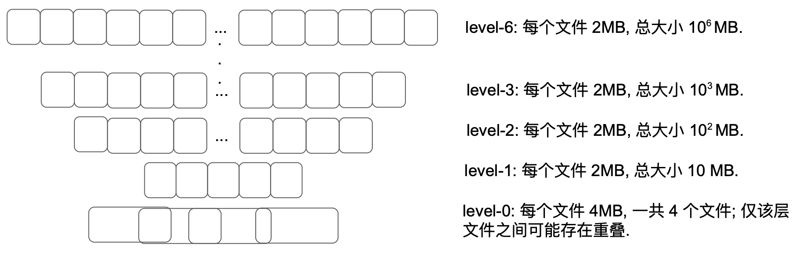

Leveldb 是一个 LSM-Tree 类型的数据库, LSM 最后一个字母就是 merge, 压实就是 merge 具体实现. 该算法在 [LSM-Tree 论文阅读笔记]() 里有介绍, 如果不了解建议先读下这篇小文.

# 1. 压实介绍

当 level-L 大小超过了上限, 具体来说就是 level-0 文件数超过 4 个, level-L(L>=1) 文件总大小超过 $10^L$ MB, 就会触后台线程的压实操作. 

压实过程会从 level-L(L>=1) 挑一个文件, 然后将 level-(L+1) 中与该文件键区间重叠的文件都找出来. 注意, 即使一个 level-L 文件仅仅与 level-(L+1) 某个文件重叠了一部分, level-(L+1) 的这个文件也会整个作为压实过程的输入, 即压实的输入最小单位是文件. 

另外, 因为 level-0 比较特殊(该层的文件之间可能相互重叠, 而其它层不会), 我们会把 level-0 到 level-1 的压实过程做特殊处理: 我们每次会从 level-0 选取相互重叠的全部文件, 而不是像其它 level 一样只选取一个文件, 然后将其合并为一个文件然后再和 level-1 与其重叠的文件进行合并. 

一次压实会合并多个文件的内容从而生成一系列新的 level-(L+1) 文件, 生成一个新文件的条件有两个: 当前文件达到了 2MB 大小或者当前文件的键区间与超过 10 个 level-(L+2) 文件发生了重叠. 第二个条件的目的在于避免后续对 level-(L+1) 文件进行压实时需要从 level-(L+2) 读取过多的数据. 

针对某一个 level 的压实会循环该 level 覆盖的整个键空间. 具体来讲, 针对 level-L, 我们会记住 level-L 上次压实的最后一个 key. 针对 level-L 的下次压实将会挑选从这个 key 之后开始的第一个文件进行. (如果不存在这样的文件, 那么就会遍历回键空间起始 key). 

压实会丢弃某个 key 对应的被覆盖过的 values(只保留时间线上最新的那个 value), 也会在没有更高的 level 包含该 key 的时候丢弃针对这个 key 的删除标记(level 越高数据越老, 所以如果某个 key 被在下层标记为删除, 在合并全部上层针对该 key 的操作之前该标记不能移除否则会被查询过程感知到老数据). 

# 2. 压实目的



前面提到了 leveldb 的数据库就是一堆在逻辑上分层的文件, 这个分层架构是从底向上开始构建的, 而压实促进了数据从 level-0 向 level-6 (leveldb 默认有 7 个 level) 的流动.

压实主要有两个目的:
1. 消除无效数据节省存储空间. Leveldb 不是 in-place 式修改的数据库, 随着修改变多, 同样的 key 可能会对应不同的数据项, 后追加的数据项会在效果上覆盖先追加的. 这就意味着先追加的数据项浪费了存储空间. 
2. 合并重叠的键空间, 减少文件数, 提升查询性能, 最好的结果就是 levels 之间没有任何重叠. 如果 level 之间存在键空间重叠, 查询某个键可能就要搜索多个层. 最简单的例子, 比如 level-1 和 level-2 的键空间都是 `[0~100)`, 但前者的键都是奇数, 后者的键都是偶数, 如果要查询的键为 10, 则会先扫描 level-1(因为键空间重叠但又肯定找不到)然后再去 level-2. 极端情况下可能要从 level-0 一路搜到 level-6 才能查到目标键, 这太消耗性能了. 最直观的解法就是尽量消除不同 level 的键空间重叠情况. 

压实行为大体分为三类: 
1. memtable 转换为 sstable, 从内存到磁盘, 落地到 level-0. 从这个意义上讲, memtable 是 leveldb 数据源头.
2. sstable 文件从 level-i 直接搬到 level-(i+1), 因为没有重叠所以不做任何合并.
3. level-i 与 level-(i+1) 之间重叠的文件合并, 生成新的 level-(i+1) 文件. 这种情况是我们重点关注的.

# 3. leveldb 的数据重复

leveldb 存在多个层面的数据重复:
- 同一个 level 内, 后追加的比先追加的数据更新(newer).
- 不同 level 之间, 低 level 的比高 level 的更新(newer).

下面我们以同一个 level 内的数据重复举个例子. 

如下图所示:

    ┌───────────┬───────────┬───────────┐
    │key1:value3│key1:value2│key1:value1│
    └───────────┴───────────┴───────────┘

这个例子中还有价值的只有 `key1:value3`, 其它空间可以通过压实释放掉.

    不熟悉 leveldb 键构成可能会对上面数据项的存储先后位置有疑问. 在 leveldb 中, 同样的 key, 由于追加有先后所以序列号不同, 后加的序列号更大. 
    
    同样 key, 序列号越大存储位置越靠前, 这样一次查找即可定位到, 不用再在同样的 key 段进行遍历了.

上面这个例子还只是同一个文件, 不同文件也可能存在 key 重复(如 level-0 的文件之间存在重叠), 不同 level 之间也可能存在 key 重复. 这些情况都可以通过 leveldb 的压实来处理.

# 4. 压实实现

下面具体说明一下压实具体实现.

## 4.1. 压实触发时机

不得不说, 压实可能是 leveldb 里面最零散的一个功能, 不管是读操作还是写操作, 还是啥也不干, 都可能触发压实. 具体触发压实的时机如下:

- 数据库刚打开的时候, 如果打开成功, 则会触发一次压实. (见 `DBImpl::Open()`)
- 如果调用 Get 查询感知到疑似需要进行压实, 则此处进一步检查确定是否触发压实, 触发条件是 `allowed_seeks` 降到了 0, 也就是因为键空间重叠导致叫下层的文件被访问次数超出阈值. (见 `DBImpl::Get()`)
- 使用 `DBIter` 迭代数据库的时候, 每隔一段就会检查下当前在迭代的 user key 是否包含在多个文件里, 如果是那就会触发压实. (见 `DBImpl::RecordReadSample()`)
- 在执行写操作的时候, 可能会把 log 文件写满, 这时就需要生成新的 log 文件并将前一个 log 文件对应的 memtable 做压实, 不过纯针对 memtable 的压实其实比较简单, 不是本文着重介绍的. (见 `DBImpl::Write()`)
- 另外就是压实任务本身可能会再调度一次压实, 原因是前一次压实可能在某一层产生过多文件. (见 `DBImpl::BackgroundCall()`)

以上都是自动触发的, 无须用户做任何操作. 除此之外, leveldb 也提供了手工触发压实的功能. leveldb 提供了接口`DBImpl::CompactRange(const Slice* begin, const Slice* end)`, 该接口提供给应用层使用, 如有需要, 用户可以直接发起压实. 

leveldb 有个后台线程池, 在上述任何一个条件满足的条件下 `DBImpl::MaybeScheduleCompaction()` 会被调用, 它会生成一个压实任务并投递到这个线程. 

`DBImpl::MaybeScheduleCompaction()` 负责投递一个异步压实任务到后台线程, 它是通过调用 `env_->Schedule(&DBImpl::BGWork, this)` 来实现的. 其中 `BGWork` 即为在后台要执行的函数, 它会间接调用 `BackgroundCompaction`, 这个函数实现了压实工作逻辑, 藏得比较深, 请大家记住它. 

下面简单介绍下 leveldb 执行后台任务的线程池的实现.

## 4.2. 后台压实线程池实现

`leveldb::PosixEnv` 类实现了后台线程池. 

毫无疑问, 后台线程池具体工作逻辑依据 *生产者-消费者* 模式, 不得不说的三件套分别为:
- 互斥锁 - `background_work_mutex_`
- 条件变量 - `background_work_cv_`
- 任务队列 - `background_work_queue_`

提交任务同时也是启动后台线程的方法为 `PosixEnv::Schedule(background_work_function, background_work_arg)`, 第一个参数为要在后台执行的函数, 第二个参数为函数在后台执行时需要的参数. 要注意的是, leveldb 后台线程池只有一个线程, 有需要执行的任务调用下面详解的方法投递到任务队列即可.

```c++
void PosixEnv::Schedule(
    void (*background_work_function)(void* background_work_arg),
    void* background_work_arg) {
  // 后面涉及几个状态需要锁保护
  background_work_mutex_.Lock(); 

  // 如果之前从未启动过后台线程, 则生成一个并让其独立运行
  if (!started_background_thread_) {
    started_background_thread_ = true;
    std::thread background_thread(PosixEnv::BackgroundThreadEntryPoint, this);
    // 调用 detach 后, 线程执行部分与线程对象 background_thread 分离, 独立去运行, 
    // 线程对象不再拥有对执行部分的所有权. 
    // 线程执行完毕会自动释放全部分配的资源. 
    // 所以一会 background_thread 出作用域被销毁也不影响
    // 线程在后台运行.
    background_thread.detach();
  }

  // 如果队列为空, 后台线程之前可能在等待, 激活之
  if (background_work_queue_.empty()) {
    background_work_cv_.Signal();
  }

  // 将本次调度的任务加到任务队列里(通过 emplace 直接构造避免了中间临时变量生成和拷贝). 
  background_work_queue_.emplace(background_work_function, background_work_arg);
  background_work_mutex_.Unlock();
}
```

## 4.3. 压实过程

整个压实实现过程, 大体如下:
1. 先压实已满的 memtable
  - 这个发生时机一般是用户 Put 数据的时候, 因为 Put 就是往 memtable 写数据. memtable 满了就不变了, 所以叫 immutable memtable, 简写为 imm.
2. 再压实 sstables, 先构造 `Compaction` 确定压实范围再进行实质压实.
  - 2.1. 针对 sstables, 要分手动触发和自动触发来构造 `Compaction`
    - 2.1.1. 如果是手动触发, 传入待压实的 level, 最小 key, 最大 key, 通过 `versions_->CompactRange(m->level, m->begin, m->end)` 来构造 `Compaction`.
    - 2.1.2. 否则就是自动触发, 调用 `versions_->PickCompaction()` 来根据统计信息确定待压实 level 和文件列表, 并构造 `Compaction`.
  - 2.2. 基于构造的 `Compaction` 执行 sstables 压实

下面代码是对上面流程的程序化(删减非强相关的异常处理等逻辑以突出重点):

```c++
// 该方法仅在 DBImpl::BackgroundCall 调用
void DBImpl::BackgroundCompaction() {
  // 压实过程需要全程持有锁, 这也暗示压实不能耗费太多时间.
  mutex_.AssertHeld();

  // 1. 先压实已满的 memtable, 满了就不变了, 所以
  // 叫 immutable memtable, 简写为 imm
  if (imm_ != nullptr) {
    CompactMemTable();
    return;
  }

  // 2.1. 针对 sstables, 下面要分手动触发和自动触发来构造 Compaction
  Compaction* c;
  // leveldb 提供了 `DBImpl::CompactRange()` 接口供应用层手工触发压实.
  bool is_manual = (manual_compaction_ != nullptr);
  // 2.1.1. 如果手动触发了一个压实
  if (is_manual) {
    ManualCompaction* m = manual_compaction_;
    // 确定压实范围, 即 level 层待压实文件列表, level+1 与之重叠文件列表.
    c = versions_->CompactRange(m->level, m->begin, m->end);
    m->done = (c == nullptr);
  } else {
    // 2.1.2. 否则根据统计信息确定待压实 level
    c = versions_->PickCompaction();
  }

  // 2.2. 执行 sstables 压实
  Status status;
  if (c == nullptr) {
    // 2.2.1. 无需压实
  } else if (!is_manual && c->IsTrivialMove()) {
    // 2.2.2. 通过移动文件实现的压实, 直接把文件从 level 移动到 level+1
    FileMetaData* f = c->input(0, 0);
    // 将该文件从 level 层删除
    c->edit()->DeleteFile(c->level(), f->number);
    // 将该文件增加到 level+1
    c->edit()->AddFile(c->level() + 1, f->number, f->file_size,
                       f->smallest, f->largest);
    // 应用本次移动操作更新 level 文件架构
    status = versions_->LogAndApply(c->edit(), &mutex_);
  } else {
    // 2.2.3. 实打实的压实
    CompactionState* compact = new CompactionState(c);
    // 做压实
    status = DoCompactionWork(compact);
    // 清理压实现场
    CleanupCompaction(compact);
  }
  delete c;
}
```

下面逐个讲解下上面的核心流程.

### 4.3.1. memtable 压实

memtable 压实本质就是将内存中的 memtable 转换为 sstable 文件并写入到磁盘中. 当且仅当该方法执行成功后, leveldb 会切换到一组新的 log-file/memtable 组合. 在这个过程中, 会计算触发压实的条件, 具体在 `versions_->LogAndApply()` 中.

```c++
void DBImpl::CompactMemTable() {
  // 调用该方法之前必须获取相应的锁.
  mutex_.AssertHeld();
  // 将内存中的 memtable 内容保存为 sstable 文件.
  // 每次落盘新文件会更改 level 架构, 需要更新到 VersionEdit 中.
  VersionEdit edit;
  // 获取当前 dbimpl 对应的最新 version
  Version* base = versions_->current();
  // 将 imm_ 引用的 memtable 以 table 文件形式保存到
	// 磁盘并将其对应的元信息(level、filemeta 等)保存到 edit 中
	// (edit 维护着 level 架构每一层文件信息, 新文件落盘要记录下来)
  Status s = WriteLevel0Table(imm_, &edit, base);

  // 用生成的 Table 替换不可变的 memtable
  if (s.ok()) {
    edit.SetPrevLogNumber(0);
    // memtable 已经转换为 Table 写入磁盘了, 之前的 logs 都不需要了.
    edit.SetLogNumber(logfile_number_);
    // 更新 level 架构信息
    s = versions_->LogAndApply(&edit, &mutex_);
  }
}
```

上面代码只保留了核心逻辑, 最核心的就两条:
1. 将 memetable 转换为 sstable 文件落盘并为其选则一个合适的 level, 这是 `WriteLevel0Table` 负责的, 这种转换前面文章讲过了, 后面会重点说下应该把新生成的 sstable 文件放到哪个 level 的决策逻辑.
2. 将本次落盘导致的 level 架构信息改变更新一下, 这是 `versions_->LogAndApply` 负责的, 这里与压实相关的是它会调用确定下个待压实 level 的方法, 下面会进行描述.

#### 4.3.1.1. 基于 memtable 生成的 sstable 应该放到哪个 level

这个逻辑是由 `Version::PickLevelForMemTableOutput()` 负责的, 该方法会在 `WriteLevel0Table` 中调用.

下面是 `WriteLevel0Table` 的核心逻辑, 主要是两块(为了突出重点删掉了其它不相干代码):

```c++
// 将 mem 对应的 memtable 以 table 文件形式保存到磁盘,
// 并将本次变更对应的元信息(level、filemeta 等)保存到 edit 中
Status DBImpl::WriteLevel0Table(MemTable* mem, VersionEdit* edit,
                                Version* base) {

  // 必须持有锁
  mutex_.AssertHeld();

  // 1. 先把 imm 转换为 sstable 并进行落盘.
  // 将 memtable 序列化为一个 sstable 文件并写入磁盘;
  // 文件大小会被保存到 meta 中, 同时将 sstable 对应的 Table 实例放入
  // table_cache_ 中.
  BuildTable(dbname_, env_, options_, table_cache_, iter, &meta);

  // 2. sstable 落盘完成, 这是物理部分; 下面要更新逻辑部分, 即 level 架构信息.
  // 为上面新生成的 sstable 文件找一个落脚的 level.
  // 注意, leveldb 文件存储和 level 架构信息存储是分开的, 
  // 文件落盘就是直接写, 相关架构信息如具体属于哪个 level, 包含的键区间,
  // 另外记录到其它地方.
  int level = 0;
  // meta 相关成员信息在 BuildTable 时填充过了
  const Slice min_user_key = meta.smallest.user_key();
  const Slice max_user_key = meta.largest.user_key();
  
  level = base->PickLevelForMemTableOutput(min_user_key, max_user_key);

  // 3. 压实完成, 将相关元信息记录到 edit, 方便后面更新 level 架构.

  // 将 [min_user_key, max_user_key] 对应的 Table 文件
  // 元信息及其 level 记录到 edit 中
  edit->AddFile(level, meta.number, meta.file_size,
                  meta.smallest, meta.largest);
  return s;
}
```

`PickLevelForMemTableOutput` 方法负责为一个 memtable 在当前 level 架构找一个落脚的 level. 如果该 memtable 与 level-0 文件有重叠, 则放到 level-0; 否则, 它的判断条件就从 level-1 开始寻找, 主要是借用了压实磁盘 level 某个文件时生成新文件的判断条件之二, 即是否"level-L 和 level-(L+2) 重叠文件超过 10 个":

```c++
int Version::PickLevelForMemTableOutput(
    const Slice& smallest_user_key,
    const Slice& largest_user_key) {
  int level = 0;
  // 检查 level-0 是否有文件与 [smallest_user_key, largest_user_key] 有重叠, 
  // 如果存在重叠, 返回 level-0; 否则进一步检查其它 levels, 最后不管选中谁, 
  // 这个目标 level 和 sstable 文件肯定没有重叠.
  if (!OverlapInLevel(0, &smallest_user_key, &largest_user_key)) {
    // 接下来就是尽量把 sstable 文件要落脚的目的地 level 尽量上推, 只要满足两个条件:
    // 1. sstable 文件和 next level 没有重叠.
    // 2. sstable 和 next of next level 重叠字节数不超过阈值.
    //
    // 注意, 此时 level 取值为 0.
    //
    // 分别构建 smallest_user_key 和 largest_user_key 对应的 internal_key. 
    // 针对 internal_key, user_key 部分越大越大, 序列号越小越大, 类型越小越大. 
    InternalKey start(smallest_user_key, kMaxSequenceNumber, kValueTypeForSeek);
    InternalKey limit(largest_user_key, 0, static_cast<ValueType>(0));
    std::vector<FileMetaData*> overlaps;
    // 压实过程: 
    //    当 level-L 大小超过了上限, 我们就在后台线程中将其压实. 
    //    压实过程会从 level-L 挑一个文件, 然后将 level-(L+1) 中与该文件键区间重叠的文件都找出来. 
    // 一次压实会合并多个被挑选文件的内容从而生成一系列新的 level-(L+1) 文件, 生成一个新文件的条件满足下述之一: 
    //    - 当前文件大小达到了 2MB
    //    - 当前文件的键区间与超过 10 个 level-(L+2) 文件发生了重叠. 
    // 第二个条件的目的在于避免后续对 level-(L+1) 文件进行压实时需要从 level-(L+2) 读取过多的数据. 
    while (level < config::kMaxMemCompactLevel) {
      // 检查 level-(L+1) 中是否存在与 [smallest_user_key, largest_user_key] 重叠的文件
      if (OverlapInLevel(level + 1, &smallest_user_key, &largest_user_key)) {
        // 如果 level-(L+1) 中存在与 [smallest_user_key, largest_user_key] 重叠的文件则跳出循环, 返回该 level
        break;
      }
      // 如果 level-(L+1) 中不存在与 [smallest_user_key, largest_user_key] 重叠的文件, 
      // 则检查 level-(L+2) 是否存在过多(过多即是看重叠文件个数是否超出阈值)与
      // [smallest_user_key, largest_user_key] 重叠的文件.
      // 如果重叠的文件数超过阈值, 则表示 level-L 需要进行压实了.
      if (level + 2 < config::kNumLevels) {
        // Check that file does not overlap too many grandparent bytes.
        // 获取 level-(L+2) 中与 [smallest_user_key, largest_user_key] 有重叠的全部文件, 
        // 并保存到 overlaps. 
        GetOverlappingInputs(level + 2, &start, &limit, &overlaps);
        // 计算 level-(L+2) 中与 [smallest_user_key, largest_user_key] 有重叠的全部文件的总大小
        const int64_t sum = TotalFileSize(overlaps);
        // 如果大小超过了阈值, 表示 level-(L+2) 存在过多与 [smallest_user_key, largest_user_key] 重叠的文件, 
        // 则跳出循环返回 level-L. (如果返回 L+1, 则下次压实 L+1 的这个文件时会从 L+2 读取过多文件.)
        if (sum > MaxGrandParentOverlapBytes(vset_->options_)) {
          break;
        }
      }
      level++;
    }
  }
  return level;
}
```

### 4.3.2. sstables 压实

#### 4.3.2.1. Compaction 构造

`Compaction` 包含了一次压实所需要的全部信息. 

```c++
class Compaction {
  // 本次要压实的 level
  int level_;
  // level_ 和 level_+1 重叠的文件列表; 
  // inputs_[0] 对应 level, inputs_[1] 对应 level+1.
  std::vector<FileMetaData*> inputs_[2];
  // 用于保存与祖父重合的文件列表
  // (parent == level_ + 1, grandparent == level_ + 2)
  // 这个主要是一个限制, 限制 level 和 level+1 合并后每个文件
  // 的大小以避免后续压实负担太重.
  std::vector<FileMetaData*> grandparents_;
}
```

接下来, 我们重点关注下, 各个成员如何被赋值的.

`PickCompaction()` 负责构造 `Compaction`, 也即为一个新的压实过程确定 level 和输入文件列表.

`PickCompaction` 确认待压实 level 主要基于两条策略(优先级先 1 后 2)：
1. 基于存储统计(VersionSet::Finalize()）发现某个 level 存储超上限严重, 拿来做压实.
2. 基于查询统计(Version::Get(), Version::UpdateStats()) 发现有文件超过查询次数上限.

明确待压实 level 后, 挑选其待压实文件, 然后从将其父 level(即 level+1)将与其重叠文件加入到待压实文件集中.

```c++
Compaction* VersionSet::PickCompaction() {
  Compaction* c;
  int level;

  // 基于存储比值计算的压实分数,
  // 小于 1 意味着未到上限, 压实不是很需要.
  // 由 VersionSet::Finalize() 计算.
  const bool size_compaction = (current_->compaction_score_ >= 1);
  // 基于查询统计而得出的下个待压实的文件
  const bool seek_compaction = (current_->file_to_compact_ != nullptr);

  // 我们倾向于因为某层数据太多而触发的压实,
  // 而非因为查询次数超过上限(即 FileMetaData->allowed_seeks)触发的压实.
  // 实现办法就是先检查大小后检查查询次数.

  // 先看有无 level 存储比值已经超过上限
  if (size_compaction) {
    // 基于存储比值而得出的下个待压实的 level.
    // 由 Finalize() 计算.
    level = current_->compaction_level_;
    c = new Compaction(options_, level);

    // 找到待压实 level 第一个可能包含 compact_pointer_[level] 的文件.
    // compact_pointer_ 记录了每个 level 各自对应的下次压实的起始 key.
    for (size_t i = 0; i < current_->files_[level].size(); i++) {
      FileMetaData* f = current_->files_[level][i];
      if (compact_pointer_[level].empty() ||
          icmp_.Compare(f->largest.Encode(), compact_pointer_[level]) > 0) {
        // 把这个文件追加到 level 对应的待压实文件集合中.
        // 每次压实非 level-0 仅提取一个文件.
        c->inputs_[0].push_back(f);
        break;
      }
    }
    // 如果 level 对应的待压实文件集合为空(说明 compact_pointer_[level]
    // 位于 level 最后一个文件之后), 则回绕到开头, 将其第一个
    // 文件加入到待压实集合.
    if (c->inputs_[0].empty()) {
      // level-0 轮流到最后了, 再绕回到开头重新开始.
      c->inputs_[0].push_back(current_->files_[level][0]);
    }
  } else if (seek_compaction) { 
    // 再看是否有文件因为查询次数过多.
    // (Version::Get() 时候*疑似包含但实际不包含*目标 key 的最底层
    // level 的第一个文件会被记录到统计信息中, 然后会被 Version::UpdateStats() 处理)
    // 而可以触发压实
    level = current_->file_to_compact_level_;
    c = new Compaction(options_, level);
    c->inputs_[0].push_back(current_->file_to_compact_);
  } else {
    return nullptr;
  }

  // level-0 文件可能彼此重叠, 所以要把全部重叠文件都加入到待压实文件集合中
  if (level == 0) {
    InternalKey smallest, largest;
    GetRange(c->inputs_[0], &smallest, &largest);
    current_->GetOverlappingInputs(0, &smallest, &largest, &c->inputs_[0]);
  }

  // 将 level+1 中与 level 对应待压实集合重叠的文件拿出来做压实, 
  // 也就是设置 c->inputs_[1]. 
  SetupOtherInputs(c);

  return c;
}

// 设置 inputs[1] 即 level+1 对应的重叠文件列表,
// 同时根据实际情况决定是否扩大 level 层的待压实文件列表,
// 即 inputs[0].
void VersionSet::SetupOtherInputs(Compaction* c) {
  const int level = c->level();
  InternalKey smallest, largest;
  // 将待压实文件的最小最大 key 找到， 放到 &smallest, &largest
  GetRange(c->inputs_[0], &smallest, &largest);

  // 将待压实文件与自己高一层的重叠文件找到， 放到 inputs_[1] 中
  current_->GetOverlappingInputs(level+1, &smallest, &largest, &c->inputs_[1]);

  // 确定 level 和 level+1 待压实的全部 key 的范围
  InternalKey all_start, all_limit;
  GetRange2(c->inputs_[0], c->inputs_[1], &all_start, &all_limit);

  // 为了尽可能多的压实数据, 确认我们是否可以在不改变 level+1 层文件个数
  // 的前提下增加 level 层的文件个数. 
  // 之所以这么限制, 是因为 level 文件个数增加可能导致 level+1 有新的重叠文件, 
  // 我们要避免最后把 level 和 level+1 文件都纳入到本次压实.
  if (!c->inputs_[1].empty()) {
    std::vector<FileMetaData*> expanded0;
    // 寻找"漏网之鱼", 将 level 层落入待压实范围的全部文件捞出来, 放到 &expanded0 以与 inputs[0] 区别
    current_->GetOverlappingInputs(level, &all_start, &all_limit, &expanded0);
    const int64_t inputs0_size = TotalFileSize(c->inputs_[0]);
    const int64_t inputs1_size = TotalFileSize(c->inputs_[1]);
    const int64_t expanded0_size = TotalFileSize(expanded0);
    // 如果 expanded0.size() > c->inputs_[0].size() 说明真有漏网之鱼,
    // 否则这两个值应该相等.
    if (expanded0.size() > c->inputs_[0].size() &&
    // 如果 level+1 层文件总大小加上 level 层落在压实范围内全部文件大小
    // 小于一次压实字节数的硬上限(25 个文件大小), 则将漏网之鱼包含进来.
        inputs1_size + expanded0_size <
            ExpandedCompactionByteSizeLimit(options_)) {
      InternalKey new_start, new_limit;
      // 获取扩展后的 level 层的起止键(文件集扩张可能导致起止键变更),
      // 放到 &new_start, &new_limit
      GetRange(expanded0, &new_start, &new_limit);
      std::vector<FileMetaData*> expanded1;
      // 重新获取 level+1 与扩展后的 level 层待压实文件的重叠文件列表， 放到 &expanded1
      current_->GetOverlappingInputs(level+1, &new_start, &new_limit,
                                     &expanded1);
      // 如果 &expanded1 大小等于 level 层待压实文件集扩大前获取的 level+1 文件集大小,
      // 这正是我们期待的(只扩张 level 待压实文件集而不改变 level+1 的).
      // 否则, 压实文件集(inputs) 不做任何变更.
      if (expanded1.size() == c->inputs_[1].size()) {
        smallest = new_start;
        largest = new_limit;
        c->inputs_[0] = expanded0;
        c->inputs_[1] = expanded1;
        GetRange2(c->inputs_[0], c->inputs_[1], &all_start, &all_limit);
      }
    }
  }

  // 计算祖父(即 level+2)与本次压实重叠的文件列表, 放到 &c->grandparents_
  if (level + 2 < config::kNumLevels) {
    current_->GetOverlappingInputs(level + 2, &all_start, &all_limit,
                                   &c->grandparents_);
  }

  // 更新 level 层下一次压实的起点.
  // 我们不等着 VersionEdit 被应用(写入 manifest)就直接在这里更新, 为的是如果本次压实
  // 失败, 我们下次就会换个键范围进行尝试.
  compact_pointer_[level] = largest.Encode().ToString();
  // 更新 VersionEdit 中关于下次压实的信息
  c->edit_.SetCompactPointer(level, largest);
}
```

有了 `Compaction` 就可以进行压实了.

#### 4.3.2.2. 基于 `Compaction` 的压实

具体压实就做一件事情:

遍历待压实文件, 如果某个 key (位于 level-L 或者 level-(L+1))的类型属性取值为"删除", 则确认其在 level-(L+2) 或之上是否存在, 若不存在则丢弃之, 否则写入合并后的文件, 压实完成更新 level 架构(即将压实后文件放到 level+1 层).

```c++
Status DBImpl::DoCompactionWork(CompactionState* compact) {
  const uint64_t start_micros = env_->NowMicros();

  // 真正做压实工作的之前要释放锁
  mutex_.Unlock();

  // 针对待压实的全部文件创建一个大迭代器
  Iterator* input = versions_->MakeInputIterator(compact->compaction);
  // 下面三个临时变量用来处理多个文件(如果压实涉及了 level-0)
  // 或多个 level 存在同样 key 的问题, 我们只关注最新的那个.
  std::string current_user_key;
  bool has_current_user_key = false;
  // 如果 user key 出现多次, 下面这个用于记录上次出现时对应的
  // internal key 的序列号.
  SequenceNumber last_sequence_for_key = kMaxSequenceNumber;
  // 遍历全部待压实 keys
  for (; input->Valid() && !shutting_down_.Acquire_Load(); ) {
    // 优先处理已经写满待压实的 memtable
    if (has_imm_.NoBarrier_Load() != nullptr) {
      mutex_.Lock();
      if (imm_ != nullptr) {
        // immutable memtable 落盘
        CompactMemTable();
      }
      mutex_.Unlock();
    }

    // 即将被处理的 key
    Slice key = input->key();
    // 当发现截止到 key, level 和 level+2 重叠数据量已经达到上限, 则
    // 开始进行压实; key 也是压实的最右区间.
    //　一进来循环看到这个判断代码可能比较懵, 肯定看不太懂, 其实下面这个判断一般
    // 要经过若干循环才能成立, 先看后面代码再回来看这个判断.
    if (compact->compaction->ShouldStopBefore(key) &&
        compact->builder != nullptr) {
      // 将压实生成的文件落盘
      status = FinishCompactionOutputFile(compact, input);
    }

    bool drop = false;
    // 反序列化为 internal key
    ParseInternalKey(key, &ikey);
    // 如果这个 key 之前迭代未出现过, 记下来
    if (!has_current_user_key ||
        user_comparator()->Compare(ikey.user_key,
                                    Slice(current_user_key)) != 0) {
      current_user_key.assign(ikey.user_key.data(), ikey.user_key.size());
      has_current_user_key = true;
      // 标记这个 user key 截止目前轮次迭代对应的序列号;
      // 因为是首次出现所以这里直接置为序列号最大可能取值.
      last_sequence_for_key = kMaxSequenceNumber;
    }

    // 当前 key 是一个墓碑消息, 而且 level-(L+2) 以及更高 level 不存在这个 key, 
    // 则可以放心删掉.
    if (ikey.type == kTypeDeletion &&
        compact->compaction->IsBaseLevelForKey(ikey.user_key)) {
      drop = true;
    }

    last_sequence_for_key = ikey.sequence;

    // 如果当前数据项不丢弃, 则进行写入合并文件
    if (!drop) {
      // 如有必要则创建新的 output file
      if (compact->builder == nullptr) {
        status = OpenCompactionOutputFile(compact);
      }
      if (compact->builder->NumEntries() == 0) {
        // 如果一个都没写过, input 迭代器又是从小到大遍历,
        // 所以当前 user key 肯定是最小的
        compact->current_output()->smallest.DecodeFrom(key);
      }
      // 否则当前 user key 目前就是最大的
      compact->current_output()->largest.DecodeFrom(key);
      // 将该 user key 对应的数据项写入 sstable.
      compact->builder->Add(key, input->value());
      // 如果 sstable 文件足够大, 则落盘并关闭
      if (compact->builder->FileSize() >=
          compact->compaction->MaxOutputFileSize()) {
        status = FinishCompactionOutputFile(compact, input);
      }
    }

    // 处理下个 key
    input->Next();
  }

  if (compact->builder != nullptr) {
    status = FinishCompactionOutputFile(compact, input);
  }
  delete input;
  input = nullptr;
  if (status.ok()) {
    // 将合并生成的新文件放到 level+1
    status = InstallCompactionResults(compact);
  }
  return status;
}
```


# 5. 总结

leveldb 作为一个典型的 LSM-Tree 实现, 压实是不可或缺的. 本文围绕压实目的、时机、实现等几个维度比较详细地介绍了 leveldb 的压实实现. 

如果只能用一句话描述 leveldb 的压实, 我们可以描述为“leveldb 基于查询统计或存储统计决定压实的文件及其所属 level, 然后确认 level+1 与其重叠的文件, 将这两层文件进行合并放到 level+1; 合并过程要避免文件过大, 避免是靠检测合并的文件大小与 level+2 的重叠字节数来实现的.”

--End--

